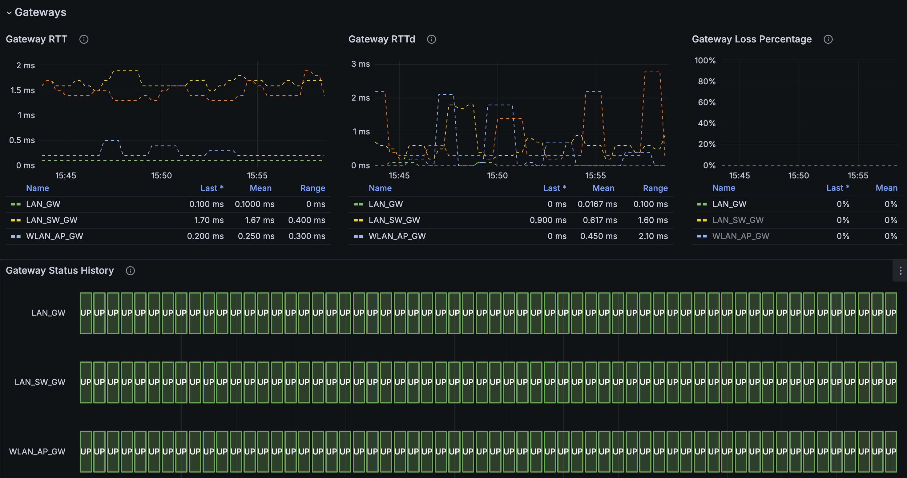

# OPNsense Prometheus Exporter

The missing OPNsense exporter for Prometheus


## Table of Contents

- **[About](#about)**
- **[Grafana Dashboard](#grafana-dashboard)**
- **[Metrics List](./docs/metrics.md)**
- **[Contributing](./CONTRIBUTING.md)**
- **[OPNsense User Permissions](#opnsense-user-permissions)**
- **[Usage](#usage)**
  - **[Docker](#docker)**
  - **[Docker Compose](#docker-compose)**
  - **[Systemd](#systemd)**
  - **[K8s](./deploy/k8s/readme.md)**
- **[Configuration](#configuration)**
  - **[OPNsense API](#opnsense-api)**
  - **[SSL/TLS](#ssltls)**
  - **[Exporters](#exporters)**
  - **[All Options](#all-options)**

## About

Focusing specifically on OPNsense, this exporter provides metrics about OPNsense, the plugin ecosystem and the services running on the firewall. However, it's recommended to use it with `node_exporter`. You can combine the metrics from both exporters in Grafana and in your Alert System to create a dashboard that displays the full picture of your system.

While the `node_exporter` must be installed on the firewall itself, this exporter can be installed on any machine that has network access to the OPNsense API.

## Grafana Dashboard

**[OPNsense Exporter Dashboard](https://grafana.com/grafana/dashboards/21113)**



Finaly we have a Grafana dashboard to visualize the data from this exporter. The dashboard can be imported into Grafana by using the id `21113` or by importing the `deploy/grafana/dashboard-v1.json` file. Please give a review to the dashboard if you like our work. Thank you!

## OPNsense user permissions

| Type     |      Name                    |
|----------|:-------------:               |
| GUI |  Diagnostics: ARP Table           |
| GUI |  Diagnostics: Firewall statistics |
| GUI |  Diagnostics: Netstat             |
| GUI |  Reporting: Traffic               |
| GUI |  Services: Unbound (MVC)          |
| GUI |  Status: DHCP leases              |
| GUI |  Status: DNS Overview             |
| GUI |  Status: OpenVPN                  |
| GUI |  Status: Services                 |
| GUI |  System: Firmware                 |
| GUI |  System: Gateways                 |
| GUI |  System: Settings: Cron           |
| GUI |  System: Status                   |
| GUI |  VPN: OpenVPN: Instances          |
| GUI |  VPN: WireGuard                   |

## Usage

### Docker

The following command will start the exporter and expose the metrics on port 8080. Replace `ops.example.com`, `your-api-key`, `your-api-secret` and `instance1` with your own values.

```bash
docker run -p 8080:8080 ghcr.io/athennamind/opnsense-exporter:latest \
      /opnsense-exporter \
      --log.level=debug \
      --log.format=json \
      --opnsense.protocol=https \
      --opnsense.address=ops.example.com \
      --opnsense.api-key=your-api-key \
      --opnsense.api-secret=your-api-secret \
      --exporter.instance-label=instance1 \
      --web.listen-address=:8080
```

TODO: Add example how to add custom CA certificates to the container.

### Docker Compose

- With environment variables

```yaml
version: '3'
services:
  opnsense-exporter:
    image: ghcr.io/athennamind/opnsense-exporter:latest
    container_name: opensense-exporter
    restart: always
    command:
      - --opnsense.protocol=https
      - --opnsense.address=ops.example.com
      - --exporter.instance-label=instance1
      - --web.listen-address=:8080
      #- --exporter.disable-arp-table
      #- --exporter.disable-cron-table
      #- ....
    environment:
      OPNSENSE_EXPORTER_OPS_API_KEY: "<your-key>"
      OPNSENSE_EXPORTER_OPS_API_SECRET: "<your-secret>"
    ports:
      - "8080:8080"
```

- With docker secrets

Create the secrets

```bash
echo "<your-key>" | docker secret create opnsense-api-key -
echo "<your-secret>" | docker secret create opnsense-api-secret -
```

Run the compose

```yaml
version: '3'
services:
  opnsense-exporter:
    image: ghcr.io/athennamind/opnsense-exporter:latest
    container_name: opensense-exporter
    restart: always
    command:
      - --opnsense.protocol=https
      - --opnsense.address=ops.example.com
      - --exporter.instance-label=instance1
      - --web.listen-address=:8080
      #- --exporter.disable-arp-table
      #- --exporter.disable-cron-table
      #- ....
    environment:
      OPS_API_KEY_FILE: /run/secrets/opnsense-api-key
      OPS_API_SECRET_FILE: /run/secrets/opnsense-api-secret
    secrets:
      - opnsense-api-key
      - opnsense-api-secret
    ports:
      - "8080:8080"
```

### Systemd

**TODO**

## Configuration

The configuration of this tool is following the standard alongside the Prometheus ecosystem. This exporter can be configured using command-line flags or environment variables.

### OPNsense API

To configure where the connection to OPNsense is, use the following flags:

- `--opnsense.protocol` - The protocol to use to connect to the OPNsense API. Can be either `http` or `https`.
- `--opnsense.address` - The hostname or IP address of the OPNsense API.
- `--opnsense.api-key` - The API key to use to connect to the OPNsense API.
- `--opnsense.api-secret` - The API secret to use to connect to the OPNsense API
- `--exporter.instance-label` - Label to use to identify the instance in every metric. If you have multiple instances of the exporter, you can differentiate them by using different value in this flag, that represents the instance of the target OPNsense. You must not start more then 1 instance of the exporter with the same value in this flag.

### SSL/TLS

For self-signed certificates, the CA certificate must be added to the system trust store.

If you want to disable TLS certificate verification, you can use the following flag:

- `--opnsense.insecure` - Disable TLS certificate verification. Defaults to `false`.

### Exporters

Gathering metrics for specific subsystems can be disabled with the following flags:

- `--exporter.disable-arp-table` - Disable the scraping of ARP table. Defaults to `false`.
- `--exporter.disable-cron-table` - Disable the scraping of Cron tasks. Defaults to `false`.
- `--exporter.disable-wireguard` - Disable the scraping of Wireguard service. Defaults to `false`.
- `--exporter.disable-unbound` - Disable the scraping of Unbound service. Defaults to `false`.
- `--exporter.disable-openvpn` - Disable the scraping of OpenVPN service. Defaults to `false`.
- `--exporter.disable-firewall` - Disable the scraping of Firewall (pf) metrics. Defaults to `false`.
- `--exporter.disable-firmware` - Disable the scraping of Firmware infos. Defaults to `false`.

To disable the exporter metrics itself use the following flag:

- `--web.disable-exporter-metrics` - Exclude metrics about the exporter itself (promhttp_*, process_*, go_*). Defaults to `false`.

### All Options

```bash
Flags:
  -h, --[no-]help                Show context-sensitive help (also try --help-long and --help-man).
      --[no-]exporter.disable-arp-table
                                 Disable the scraping of the ARP table ($OPNSENSE_EXPORTER_DISABLE_ARP_TABLE)
      --[no-]exporter.disable-cron-table
                                 Disable the scraping of the cron table ($OPNSENSE_EXPORTER_DISABLE_CRON_TABLE)
      --[no-]exporter.disable-wireguard
                                 Disable the scraping of Wireguard service ($OPNSENSE_EXPORTER_DISABLE_WIREGUARD)
      --[no-]exporter.disable-unbound
                                 Disable the scraping of Unbound service ($OPNSENSE_EXPORTER_DISABLE_UNBOUND)
      --[no-]exporter.disable-openvpn
                                 Disable the scraping of OpenVPN service ($OPNSENSE_EXPORTER_DISABLE_OPENVPN)
      --[no-]exporter.disable-firewall
                                 Disable the scraping of the firewall (pf) metrics ($OPNSENSE_EXPORTER_DISABLE_FIREWALL)
      --[no-]exporter.disable-firmware
                                 Disable the scraping of the firmware metrics ($OPNSENSE_EXPORTER_DISABLE_FIRMWARE)
      --web.telemetry-path="/metrics"
                                 Path under which to expose metrics.
      --[no-]web.disable-exporter-metrics
                                 Exclude metrics about the exporter itself (promhttp_*, process_*, go_*).
                                 ($OPNSENSE_EXPORTER_DISABLE_EXPORTER_METRICS)
      --runtime.gomaxprocs=2     The target number of CPUs that the Go runtime will run on (GOMAXPROCS) ($GOMAXPROCS)
      --exporter.instance-label=EXPORTER.INSTANCE-LABEL
                                 Label to use to identify the instance in every metric. If you have multiple instances of the
                                 exporter, you can differentiate them by using different value in this flag, that represents
                                 the instance of the target OPNsense. ($OPNSENSE_EXPORTER_INSTANCE_LABEL)
      --[no-]web.systemd-socket  Use systemd socket activation listeners instead of port listeners (Linux only).
      --web.listen-address=:8080 ...
                                 Addresses on which to expose metrics and web interface. Repeatable for multiple addresses.
                                 Examples: `:9100` or `[::1]:9100` for http, `vsock://:9100` for vsock
      --web.config.file=""       Path to configuration file that can enable TLS or authentication. See:
                                 https://github.com/prometheus/exporter-toolkit/blob/master/docs/web-configuration.md
      --opnsense.protocol=OPNSENSE.PROTOCOL
                                 Protocol to use to connect to OPNsense API. One of: [http, https]
                                 ($OPNSENSE_EXPORTER_OPS_PROTOCOL)
      --opnsense.address=OPNSENSE.ADDRESS
                                 Hostname or IP address of OPNsense API ($OPNSENSE_EXPORTER_OPS_API)
      --opnsense.api-key=""      API key to use to connect to OPNsense API. This flag/ENV or the OPS_API_KEY_FILE my be set.
                                 ($OPNSENSE_EXPORTER_OPS_API_KEY)
      --opnsense.api-secret=""   API secret to use to connect to OPNsense API. This flag/ENV or the OPS_API_SECRET_FILE my be
                                 set. ($OPNSENSE_EXPORTER_OPS_API_SECRET)
      --[no-]opnsense.insecure   Disable TLS certificate verification ($OPNSENSE_EXPORTER_OPS_INSECURE)
      --log.level=info           Only log messages with the given severity or above. One of: [debug, info, warn, error]
      --log.format=logfmt        Output format of log messages. One of: [logfmt, json]
```
