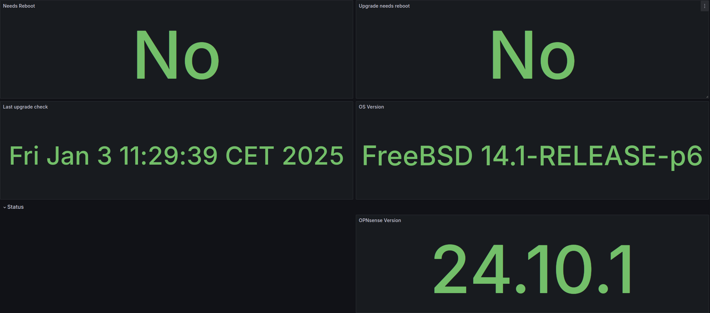

## OPNsense Exporter Metrics List

This table represent each metric and it's labels, the subsystem that it belongs, its description and how to disable it. The opnsense_instance label is applied to all metrics.

### General 

| Metric Name | Type | Labels | Subsystem | Description | Disable Flag |
| --- | --- | --- | --- | --- | --- |
opnsense_up | Gauge | opnsense_instance | n/a | The current status of OPNsense (1 = up, 0 = down) | n/a |
opnsense_firewall_status | Gauge | opnsense_instance | n/a | Status of the firewall reported by `api/core/system/status` ( 1 = ok, 0 = errors) | n/a |
opnsense_exporter_scrapes_total | Counter | n/a | n/a | Total number of scrapes by the OPNsense exporter | n/a |
opnsense_exporter_endpoint_errors_total | Counter | endpoint | n/a | Total number of errors by endpoint returned by the OPNsense API during data fetching | n/a |
opnsense_cron_job_status | Gauge | command, description, origin, schedule | Cron Table | Cron job status by name and description (1 = enabled, 0 = disabled) | --exporter.disable-cron-table |

### Services 

| Metric Name | Type | Labels | Subsystem | Description | Disable Flag |
| --- | --- | --- | --- | --- | --- |
opnsense_services_running_total | Gauge | n/a | Services | Total number of running services | n/a |
opnsense_services_stopped_total | Gauge | n/a | Services | Total number of stopped services | n/a |
opnsense_services_status | Gauge | name, description | Services | Service status by name and description (1 = running, 0 = stopped) | n/a |

### Interfaces

| Metric Name | Type | Labels | Subsystem | Description | Disable Flag |
| --- | --- | --- | --- | --- | --- |
opnsense_interfaces_mtu_bytes | Gauge | interface, device, type | Interfaces | MTU of the interface by interface name and device | n/a |
opnsense_interfaces_received_bytes_total | Counter | interface, device, type | Interfaces | Total number of received bytes on this interface by interface name and device | n/a |
opnsense_interfaces_transmitted_bytes_total | Counter | interface, device, type | Interfaces | Total number of transmitted bytes on this interface by interface name and device | n/a |
opnsense_interfaces_received_multicasts_total | Counter | interface, device, type | Interfaces | Total number of received multicast packets on this interface by interface name and device | n/a |
opnsense_interfaces_transmitted_multicasts_total | Counter | interface, device, type | Interfaces | Total number of transmitted multicast packets on this interface by interface name and device | n/a |
opnsense_interfaces_input_errors_total | Counter | interface, device, type | Interfaces | Input errors on this interface by interface name and device | n/a |
opnsense_interfaces_output_errors_total | Counter | interface, device, type | Interfaces | Output errors on this interface by interface name and device | n/a |
opnsense_interfaces_collisions_total | Counter | interface, device, type | Interfaces | Collisions on this interface by interface name and device | n/a |

### Firewall

| Metric Name | Type | Labels | Subsystem | Description | Disable Flag |
| --- | --- | --- | --- | --- | --- |
opnsense_firewall_in_ipv4_block_packets | Gauge | interface | Firewall | The number of IPv4 incoming packets that were blocked by the firewall by interface | --exporter.disable-firewall |
opnsense_firewall_in_ipv4_pass_packets | Gauge | interface | Firewall | The number of IPv4 incoming packets that were passed by the firewall by interface | --exporter.disable-firewall |
opnsense_firewall_out_ipv4_block_packets | Gauge | interface | Firewall | The number of IPv4 outgoing packets that were blocked by the firewall by interface | --exporter.disable-firewall |
opnsense_firewall_out_ipv4_pass_packets | Gauge | interface | Firewall | The number of IPv4 outgoing packets that were passed by the firewall by interface | --exporter.disable-firewall |
opnsense_firewall_in_ipv6_block_packets | Gauge | interface | Firewall | The number of IPv6 incoming packets that were blocked by the firewall by interface | --exporter.disable-firewall |
opnsense_firewall_in_ipv6_pass_packets | Gauge | interface | Firewall | The number of IPv6 incoming packets that were passed by the firewall by interface | --exporter.disable-firewall |
opnsense_firewall_out_ipv6_block_packets | Gauge | interface | Firewall | The number of IPv6 outgoing packets that were blocked by the firewall by interface | --exporter.disable-firewall |
opnsense_firewall_out_ipv6_pass_packets | Gauge | interface | Firewall | The number of IPv6 outgoing packets that were passed by the firewall by interface | --exporter.disable-firewall |

### Firmware

| Metric Name | Type | Labels | Subsystem | Description | Disable Flag |
| --- | --- | --- | --- | --- | --- |
opnsense_firmware_last_check | Gauge | last_check | firmware | Last upgrade check for OPNsense | --exporter.disable-firmware |
opnsense_firmware_needs_reboot | Gauge | needs_reboot | Firmware | Wether the OPNsense has a pending reboot | --exporter.disable-firmware |
opnsense_firmware_new_packages | Gauge | new_packages | Firmware | Amount of packages that will be newly installed during upgrade | --exporter.disable-firmware |
opnsense_firmware_os_version | Gauge | os_version | Firmware | OS Version of OPNsense | --exporter.disable-firmware |
opnsense_firmware_product_abi | Gauge | product_api | Firmware | Product ABI of OPNsense | --exporter.disable-firmware |
opnsense_firmware_product_id | Gauge | product_id | Firmware | Product ID (community or business) of OPNsense | --exporter.disable-firmware |
opnsense_firmware_product_version | Gauge | product_version | Firmware | Product version of OPNsense | --exporter.disable-firmware |
opnsense_firmware_upgrade_needs_reboot | Gauge | upgrade_needs_reboot | Firmware | Wether the upgrade will involve a reboot | --exporter.disable-firmware |
opnsense_firmware_upgrade_packages | Gauge | upgrade_packages | Firmware | Amount of packages that will be upgraded during upgrade | --exporter.disable-firmware |

### ARP

| Metric Name | Type | Labels | Subsystem | Description | Disable Flag |
| --- | --- | --- | --- | --- | --- |
opnsense_arp_table_entries | Gauge | expired, hostname, interface_description, ip, mac, permanent, type | ARP Table | Arp entries by ip, mac, hostname, interface description, type, expired and permanent | --exporter.disable-arp-table |
opnsense_protocol_arp_sent_requests_total | Counter | n/a | Protocol Statistics | Total Number of sent ARP requests  | n/a |
opnsense_protocol_arp_received_requests_total | Counter | n/a | Protocol Statistics | Total Number of received ARP requests  | n/a |

### Gateways

| Metric Name | Type | Labels | Subsystem | Description | Disable Flag |
| --- | --- | --- | --- | --- | --- |
opnsense_gateways_info | Gauge | name, description, device, protocol, enabled, weight, interface, upstream | Gateways | Configuration details of the gateway | n/a |
opnsense_gateways_monitor_info | Gauge | name, enabled, no_route, address | Gateways | Configuration details of the gateway monitoring | n/a |
opnsense_gateways_status | Gauge | address, name | Gateways | Status of the gateway by name and address (1 = up, 0 = down, 2 = unknown, 3 = pending) | n/a |
opnsense_gateways_loss_percentage | Gauge | address, name | Gateways | The current gateway loss percentage by name and address | n/a |
opnsense_gateways_rtt_milliseconds | Gauge | address, name | Gateways | RTT is the average (mean) of the round trip time in milliseconds by name and address | n/a |
opnsense_gateways_rttd_milliseconds | Gauge | address, name | Gateways | RTTd is the standard deviation of the round trip time in milliseconds by name and address | n/a |
opnsense_gateways_rtt_low_milliseconds | Gauge | address, name | Gateways | Lower threshold for the round trip time in milliseconds by name and address | n/a |
opnsense_gateways_rtt_high_milliseconds | Gauge | address, name | Gateways | Upper threshold for the round trip time in milliseconds by name and address | n/a |
opnsense_gateways_loss_low_percentage | Gauge | address, name | Gateways | Lower threshold for the packet loss ratio by name and address | n/a |
opnsense_gateways_loss_high_percentage | Gauge | address, name | Gateways | Upper threshold for the packet loss ratio by name and address | n/a |
opnsense_gateways_probe_interval_seconds | Gauge | address, name | Gateways | Monitoring probe interval duration by name and address | n/a |
opnsense_gateways_probe_period_seconds | Gauge | address, name | Gateways | Monitoring probe period over which results are averaged by name and address | n/a |
opnsense_gateways_probe_timeout_seconds | Gauge | address, name | Gateways | Monitoring probe timeout by name and address | n/a |

### Protocol Statistics

| Metric Name | Type | Labels | Subsystem | Description | Disable Flag |
| --- | --- | --- | --- | --- | --- |
opnsense_protocol_tcp_sent_packets_total | Counter | n/a | Protocol Statistics | Total Number of sent TCP packets  | n/a |
opnsense_protocol_tcp_received_packets_total | Counter | n/a | Protocol Statistics | Total Number of received TCP packets | n/a |
opnsense_protocol_tcp_connection_count_by_state | Gauge | state | Protocol Statistics | Number of TCP connections by state | n/a |
opnsense_protocol_udp_delivered_packets_total | Counter | n/a | Protocol Statistics | Total Number of delivered UDP packets | n/a |
opnsense_protocol_udp_output_packets_total | Counter | n/a | Protocol Statistics | Total Number of output UDP packets  | n/a |
opnsense_protocol_udp_received_datagrams_total | Counter | n/a | Protocol Statistics | Total Number of received UDP Datagrams | n/a |
opnsense_protocol_udp_dropped_by_reason_total | CounterVector | reason | Protocol Statistics | Total Number of dropped UDP packets by reason | n/a |
opnsense_protocol_icmp_calls_total | Counter | n/a | Protocol Statistics | Total Number of ICMP calls | n/a |
opnsense_protocol_icmp_sent_packets_total | Counter | n/a | Protocol Statistics | Total Number of sent ICMP packets | n/a |
opnsense_protocol_icmp_dropped_by_reason_total | CounterVector | reason | Protocol Statistics | Total Number of dropped ICMP packets by reason | n/a |

### Unbound DNS

| Metric Name | Type | Labels | Subsystem | Description | Disable Flag |
| --- | --- | --- | --- | --- | --- |
opnsense_unbound_dns_uptime_seconds | Gauge | n/a | Unbound | Uptime of the unbound DNS service in seconds | --exporter.disable-unbound |

### Wireguard 

| Metric Name | Type | Labels | Subsystem | Description | Disable Flag |
| --- | --- | --- | --- | --- | --- |
opnsense_wireguard_interfaces_status | Gauge | name, description, public_key | Wireguard | Wireguard interfaces status by name, description and public key (1 = up, 0 = down) | --exporter.disable-wireguard  |
opnsense_wireguard_peer_received_bytes_total | Counter | device, device_type, device_name, peer_name | Wireguard | Bytes received by this wireguard peer | --exporter.disable-wireguard  |
opnsense_wireguard_peer_transmitted_bytes_total | Counter | device, device_type, device_name, peer_name | Wireguard | Bytes transmitted by this wireguard peer | --exporter.disable-wireguard  |
opnsense_wireguard_peer_last_handshake_seconds | Gauge | device, device_type, device_name, peer_name | Wireguard | Last handshake time in seconds by this wireguard peer | --exporter.disable-wireguard  |

### OpenVPN

| Metric Name | Type | Labels | Subsystem | Description | Disable Flag |
| --- | --- | --- | --- | --- | --- |
opnsense_openvpn_instances | Gauge | description, device_type, role, uuid | OpenVPN | OpenVPN instances (1 = enabled, 0 = disabled) by role (server, client) | --exporter.disable-openvpn |
